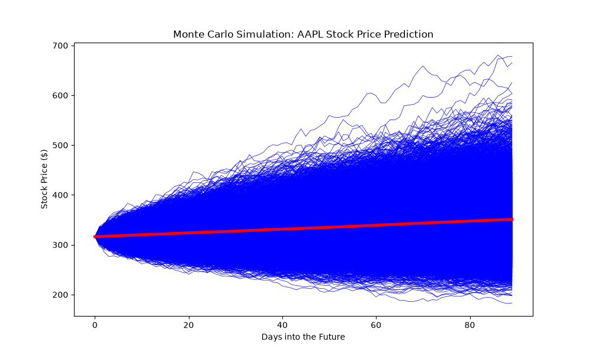

# Apple (AAPL) Monte Carlo Simulation & Risk Management Dashboard

A quantitative finance application utilizing a **Geometric Brownian Motion (GBM)** stochastic model to simulate 10,000 potential future price paths for Apple Inc. (AAPL) over a 90-day horizon. 

This project integrates live historical financial data to compute forward-looking expected paths and institutional-grade risk parameters, providing a practical demonstration of quantitative asset modeling.

---

## 🚀 Key Features

- **Live Financial Data Pipeline:** Leverages the `yfinance` API to dynamically pull daily historical closing prices for parameter estimations.
- **Stochastic Modeling (Geometric Brownian Motion):** Employs randomized log-returns adjusted for mathematical drift ($\mu - \frac{1}{2}\sigma^2$) and volatility ($\sigma$) to generate complex multi-path simulations.
- **Dynamic Risk Analysis:** - Calculates the **Empirical Probability of Profit** across all 10,000 parallel worlds.
  - Computes user-defined **Value at Risk (VaR)** boundaries mapping out worst-case loss limits.
  - Implements **Expected Shortfall (CVaR)** to measure the average magnitude of losses beyond the VaR cliff.
- **Interactive Visualization:** Renders all 10,000 simulated pathways overlayed with a bold, vectorized expected daily mean path.

---

## 📈 Methodology & Math

Stock price changes are calculated daily using a discretized log-normal growth factor:
$$S_t = S_{t-1} \times e^{(\text{drift} + \sigma \times Z)}$$

Where:
* $S_0$ is the actual live baseline closing price of AAPL at the end of the historical dataset.
* `drift` represents the trend asset component adjusted for variance drag.
* $Z$ is a random standard normal scalar generated via `np.random.normal(0,1)`.

---

## 🛠️ Installation & Usage

### Prerequisites
Make sure you have Python installed alongside the required numerical and plotting libraries:

```bash
pip install numpy pandas yfinance matplotlib
---
```
## Visualizing the 10,000 Futures

